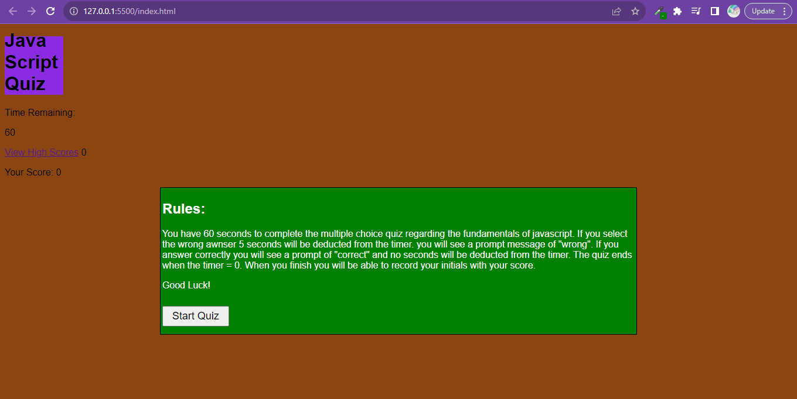

# JavaScript Quiz

 This is a JavaScript file with CSS styling and an HTML structure allowing for a user to take a timed quiz with questions testing the users JavaScript fundamental knowledge that stores high the users initials and scores.

## User Story

I WANT to take a timed quiz on JavaScript fundamentals that stores high scores
SO THAT I can gauge my progress compared to my peers
Acceptance Criteria:

GIVEN I am taking a code quiz
WHEN I click the start button
THEN a timer starts and I am presented with a question
WHEN I answer a question
THEN I am presented with another question
WHEN I answer a question incorrectly
THEN time is subtracted from the clock
WHEN all questions are answered or the timer reaches 0
THEN the game is over
WHEN the game is over
THEN I can save my initials and my score

## Motivation

I created this website to further my education with JavaScript, CSS, and HTML.

## Why

I wanted to create a website that would allow users to take a timed quiz on JavaScript fundamentals that stores high scores. I wanted to challenge myself and further develop my skills.

## What Problem Does it Solve?

This quiz allows users to test their knowledge of JavaScript fundamentals and stores their high scores.

## What Did I Learn?

I learned about the fundamentals of JavaScript including, but not limited to, functions, variables, arrays, objects, and loops. I also learned how to use the DOM to manipulate HTML elements and how to use local storage to store data.

## Usage

To use this website, simply click the start button and answer the questions. If you answer a question incorrectly, time will be subtracted from the clock. When all questions are answered or the timer reaches 0, the game is over. When the game is over, you can save your initials and your score.

## preview of website

#### Link to githubrepo: 
<https://github.com/precisecoding/JavascriptQuiz-m4.git>

#### Deployed link: 
<https://precisecoding.github.io/JavascriptQuiz-m4/>

#### This site was built using github pages.
<https://pages.github.com/>

##### License
MIT License
<https://opensource.org/licenses/MIT>
<https://choosealicense.com/licenses/mit/>
LICENSE file included in repository.

##### Thanks to everyone for support and contributions!
Sources used:
<https://developer.mozilla.org/en-US/>, <https://www.w3schools.com/>, <https://stackoverflow.com/>. Worked with tutor, Cody Junier from DU Whow was helpful along with TA George Yoo.